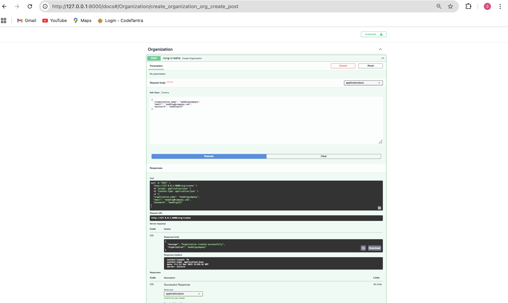
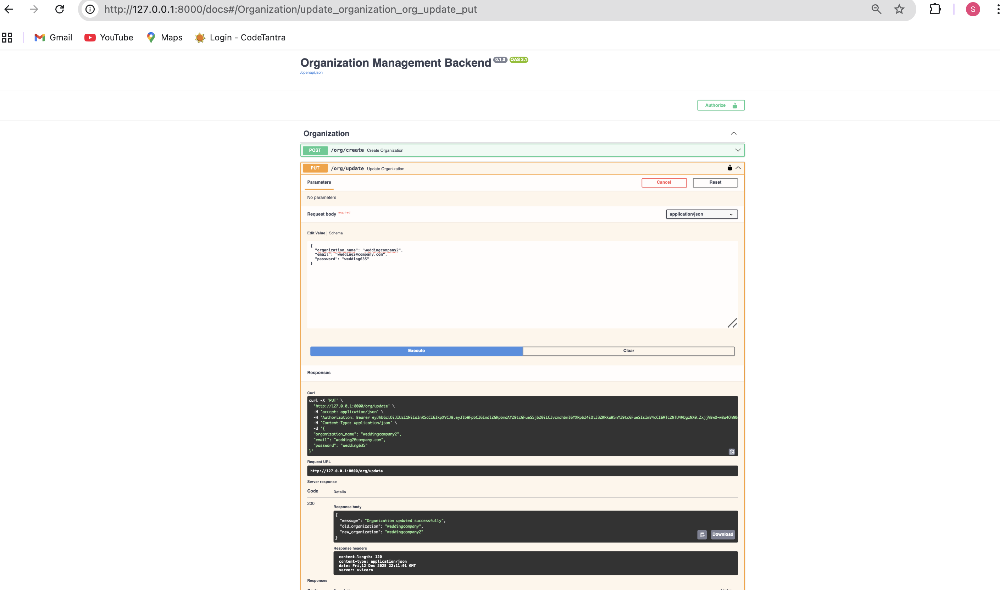
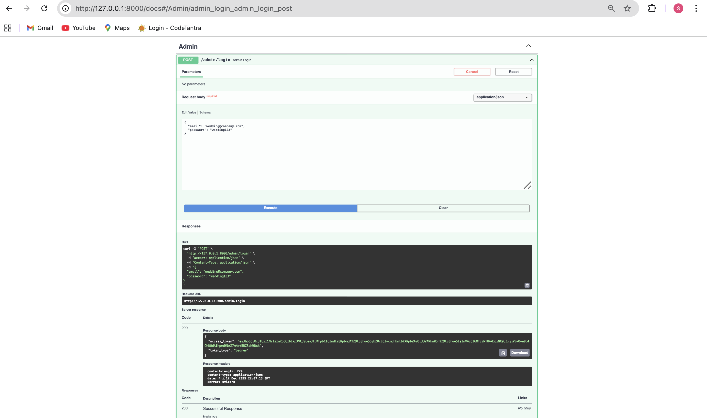

<!DOCTYPE html>
<html lang="en">
<head>
    <meta charset="UTF-8">
</head>
<body>

<h1>Organization Management Backend</h1>

A backend service built using <strong>FastAPI</strong> and <strong>MongoDB</strong> to manage
multiple organizations in a secure, multi-tenant architecture.
Each organization has its own dynamically created MongoDB collection,
with admin authentication handled using JWT.

<h2>🚀 Tech Stack</h2>
<ul>
    <li>FastAPI (Python)</li>
    <li>MongoDB Atlas</li>
    <li>JWT Authentication (python-jose)</li>
    <li>Password Hashing (passlib + bcrypt_sha256)</li>
</ul>

<h2>📦 Features</h2>
<ul>
    <li>Create organizations with dynamic MongoDB collections</li>
    <li>Secure admin login with JWT authentication</li>
    <li>Update organization with data migration between collections</li>
    <li>Delete organization (JWT protected)</li>
</ul>

<h2>🧠 Architecture Overview</h2>

The application follows a <strong>multi-tenant architecture</strong>:

<ul>
    <li><strong>master_db</strong> stores:
        <ul>
            <li>Organization metadata</li>
            <li>Admin credentials (securely hashed)</li>
        </ul>
    </li>
    <li>Each organization has its own MongoDB collection:
        <code>org_&lt;organization_name&gt;</code>
    </li>
    <li>JWT tokens carry organization context for authorization</li>
</ul>

<pre>
+---------------------+
|     Client / UI     |
| (Chrome / Postman) |
+----------+----------+
           |
           | HTTP Requests (JSON)
           | Authorization: Bearer <JWT>
           v
+--------------------------------------+
|          FastAPI Backend              |
|--------------------------------------|
|                                      |
|  ┌──────────────────────────────┐    |
|  | Authentication Layer          |    |
|  |------------------------------|    |
|  | - Admin Login (/admin/login) |    |
|  | - JWT Generation             |    |
|  | - JWT Validation (Depends)   |    |
|  └───────────────┬──────────────┘    |
|                  |                   |
|  ┌───────────────▼──────────────┐    |
|  | Organization APIs             |    |
|  |------------------------------|    |
|  | POST   /org/create            |    |
|  | PUT    /org/update            |    |
|  | DELETE /org/delete            |    |
|  └───────────────┬──────────────┘    |
|                  |                   |
|        MongoDB Driver (PyMongo)       |
+------------------┼-------------------+
                   |
                   v
+--------------------------------------+
|          MongoDB Atlas                |
|--------------------------------------|
|                                      |
|  ┌────────────────────────────────┐  |
|  | master_db                      |  |
|  |--------------------------------|  |
|  | organizations                  |  |
|  | - org_name                     |  |
|  | - collection_name              |  |
|  |                                |  |
|  | admins                         |  |
|  | - email                        |  |
|  | - hashed_password              |  |
|  | - organization                 |  |
|  └────────────────────────────────┘  |
|                                      |
|  ┌────────────────────────────────┐  |
|  | org_<organization_name>         |  |
|  |--------------------------------|  |
|  | Tenant-specific data           |  |
|  └────────────────────────────────┘  |
|                                      |
|  ┌────────────────────────────────┐  |
|  | org_<another_organization>     |  |
|  └────────────────────────────────┘  |
|                                      |
+--------------------------------------+

</pre>

<h2>🔐 Authentication</h2>

<ul>
    <li>Admin login uses JWT-based authentication</li>
    <li>Passwords are hashed using <code>bcrypt_sha256</code></li>
    <li>Protected routes require a valid JWT token</li>
</ul>

<h2>📌 API Endpoints</h2>

<ul>
    <li><code>POST /org/create</code> – Create a new organization
    </li>
     

    <li><code>PUT /org/update</code> – Update organization and migrate data</li>
    
    <li><code>DELETE /org/delete</code> – Delete organization (JWT protected)</li>
    
    <li><code>POST /admin/login</code> – Admin login (returns JWT)</li>
    
</ul>

<h2>⚙️ Setup Instructions</h2>

<h3>1️⃣ Clone the Repository</h3>
<pre>
git clone &lt;your-repository-url&gt;
cd Organization-Management-Backend
</pre>

<h3>2️⃣ Create Virtual Environment</h3>
<pre>
python3 -m venv venv
source venv/bin/activate
</pre>

<h3>3️⃣ Install Dependencies</h3>
<pre>
pip install -r requirements.txt
</pre>

<h3>4️⃣ Environment Variables</h3>

Create a <code>.env</code> file:

<pre>
MONGO_URI=your_mongodb_connection_string
JWT_SECRET=your_secret_key
</pre>

<h3>5️⃣ Run the Application</h3>
<pre>
uvicorn app.main:app --reload
</pre>

Swagger Docs available at:
<code>http://127.0.0.1:8000/docs</code>

<h2>📈 Scalability & Trade-offs</h2>

This design is well-suited for small to medium-scale systems.
Dynamic collections provide strong tenant isolation and simplicity.

<h3>Pros</h3>
<ul>
    <li>Clear data isolation per organization</li>
    <li>Simple and readable architecture</li>
    <li>Low operational complexity</li>
</ul>

<h3>Trade-offs</h3>
<ul>
    <li>Large number of organizations may lead to many collections</li>
    <li>Collection-based migration can be costly for very large datasets</li>
</ul>

For large-scale systems, a shared collection model using <code>org_id</code>
or database-per-tenant architecture could be considered.

<h2>📝 Notes</h2>
<ul>
    <li>Secrets are managed via environment variables</li>
    <li><code>.env</code> is excluded using <code>.gitignore</code></li>
    <li>Project follows modular and clean design principles</li>
</ul>

<h2>How Could This Be Improved for Large-Scale Systems?</h2>
<h3>For larger or enterprise-level systems, alternative designs could be considered:</h3>
<ul>
    <li>
        Shared Collection Model: Store all tenant data in shared collections with an indexed org_id. This reduces the             number of collections and improves scalability.
    </li>
    <li>
         Database-Per-Tenant Architecture:
        Each organization gets its own database for maximum isolation, at the cost of increased operational complexity             and infrastructure overhead.
     </li>
    <li>
        Async & Background Jobs:
Use async MongoDB drivers and background workers for heavy operations like data migration.
    </li>
    <li>
        Role-Based Access Control (RBAC):
Introduce roles and permissions for finer-grained access control.
    </li>
    <li>
        Caching Layer:
Add Redis or similar caching for frequently accessed metadata.
    </li>
</ul>
</body>
</html>
